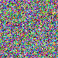
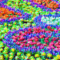
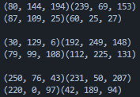
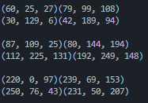
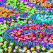
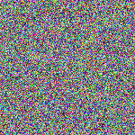
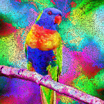
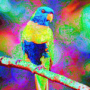
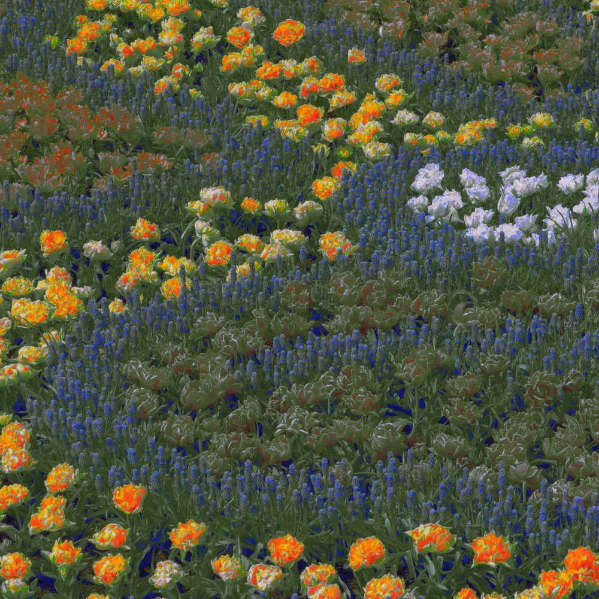

# Pixel Assignment

I want to take two distinct images, and rearrange the pixels in image1 in 
such a way that the resultant image is visually similar to the image2. To 
simplify an already complicated process, we will only use images of 
the same size. We will also have im1 being composed of 
randomly generated pixels, though this isn't a restriction of the code.

At its core, this is an application of the [assignment problem](https://en.wikipedia.org/wiki/Assignment_problem). 
To implement a direct solution, we can use the Hungarian algorithm, which can be imported through scipy.

We will describe the cost of assigning a pixel in im1 to im2 as the 'distance' between the two pixels. 
If the pixels are described in RGB, this means that we weigh the influence on each of R, G, and B 
equally in our calculation. This is not ideal, as B has a much larger influence on 
what a pixel looks like than G (and in general, the comparisons are not equal). 
Instead of RGB, we will use LAB, which is designed specifically to remove this 
discrepancy. This makes the code more complicated, as a conversion to LAB is not 
easily done with the PIL module used.

We will measure the success of an approach by the 'average pixel distance' of the 
resultant image from im2 (the image it is trying to replicate).

## Hungarian Solution

Very simply, we can create a cost matrix between two images, 
use the Hungarian algorithm, and 
map the pixels to their new locations. This approach will make the resultant 
image 'perfect', as far as reducing LAB distance goes.

We start with our ideal outcome image:
 
Then convert random pixels to resemble it:

As intended, we get a very accurate resultant image. It is no mistake, however, 
that the image is very small. The Hungarian algorithm runs in O(n^3) time, with 
n here representing the number of pixels. This value can become very large very 
quickly. 
Ignoring the time limitation, this method also requires an nxn matrix being made, 
which can take an exorbitant amount of space. To remedy these issues, I've 
included an alternate approach.

## Array Sorting

By sorting both image data before directly mapping the corresponding pixels, we 
can get an accurate assignment completely skipping cost calculation, omitting 
the space cost, and reducing the time cost considerably.

We want to take each of L, A, and B into consideration in our sort, and so we 
end up expressing the data in 3-dimensional space. This done with custom array 
classes. 

The intuitive sorting approach involves sorting first by L into different 
squares (2d), sorting then by A into different rows (1d), then finally sorting 
the rows of the squares of the 'cube' by B. This unfortunately heavily 
prioritizes L over A and A over B, which can give us some massive square 
difference (our measure of success).

Instead, the squares will be sorted along the diagonals, with the sum of A and B
reducing along the top-left to bottom-right diagonal, with the difference between 
A and B reducing along the top-right to bottom-left diagonal. This done so 
that swapping A and B makes no difference.

Sorting from the cube to the squares will still be done strictly by L, as to 
avoid massive complexity for a small difference. Fortunately, L is distinct from 
A and B, as A and B together describes color, while L describes lightness. 
Visually, prioritizing L may actually help our resultant image.

To help understand what's going on, here's an array before and after being sorted:

 ->

Using the same two images:

and giving us

also incredibly close, and done in significantly less time and space.

## Comparison of Approaches

For all of the run code and following comparisons, it was first confirmed that 
the pixel data in each of the images was identical (done in PixelVerification.py). 

### Flowers
#### Hungarian
Average pixel distance to original image: 38.73 
Runtime: 51 seconds
#### Array Sort
Average pixel distance to original image: 50.54 
Runtime: less than 2 seconds

The pixel distance is non-negligible. The Hungarian approach produced a much 
closer image. This is, however, potentially due to the choice of image. The 
flowers chosen closely resemble the colors of the pixels generated. Take another 
(larger) example:

using

Hungarian on left, ArraySort on right:

### Lorikeet
#### Hungarian
Average pixel distance to original image: 72.20 
Runtime: 100 minutes
#### Array Sort
Average pixel distance to original image: 79.83 
Runtime: 4.25s

The random images have less a difference in a larger, less colorful image. 
The accuracy of the hungarian algorithm will always be higher, simply because 
it's the ideal result. We are, however, already reaching runtimes over an 
hour and a half, and using an array of size (150x150)^2 = 506,250,000.

The sorting approach can be improved, but is already quite accurate. Prioritizing 
lightness over color also may result in a much smoother looking image, as opposed 
to the hungarian randomness.

## Larger Image / Non-Random Pixels
These algorithms have no requirement to involve random pixels. To close, here 
is the same flower image formed out of the pixels of the lorikeet (1000 x 1000)

